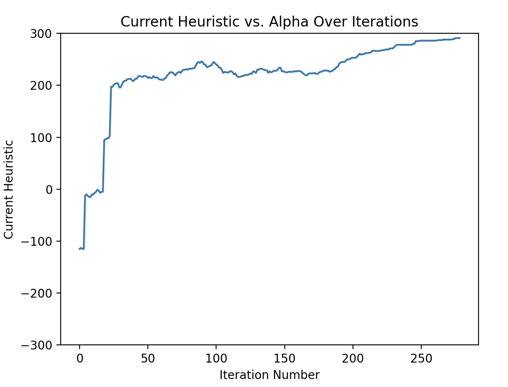
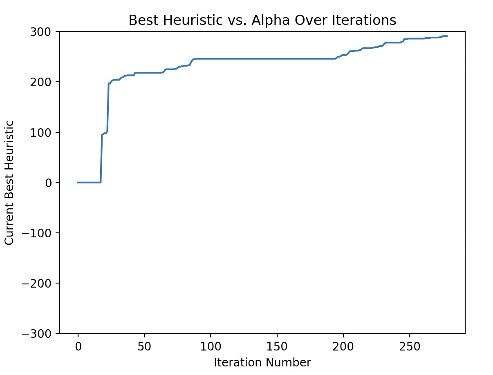
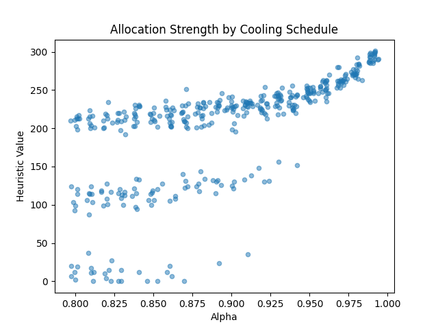

# SCOPE Teaming Algorithm

Team Members: Amit Kumar-Hermosillo, Lily Jiang

## How to Run This Project

If you have this repo installed locally on your computer, follow these steps to
run the project:

1. Ensure you have the right dependencies installed. All dependencies are listed
   in the "Libraries Used" section ([jump to section](#libraries-used)). You can
   install them all at once by running `pip install -r requirements.txt`.
2. To run the simulated annealing algorithm one time, run
   `python sim_annealing.py`. This will write the final solution to a file
   called `best_solution.txt`, and display visuals of the annealing process.
3. For other capabilities like viewing a sweep of alpha values, uncomment the
   appropriate lines in the `main` function of `sim_annealing.py`.

## Technical Write Up

### Background of Algorithm (~1-2 paragraphs)

This implementation relies on Simulated Annealing, which is a metaheuristic
inspired by annealing in metallurgy (a process that involves heating a metal to
a high temperature and slowly cooling it down to remove defects in its crystal
structure). The algorithm starts at a "high temperature", meaning it is more
willing to accept a random solution that is worse than the current solution so
it explores a wide range of solutions. As the algorithm "cools down", it becomes
less willing to accept worse solutions, allowing it to converge to a solution.
Because of this mechanic, this algorithm is better at handling complex,
multi-peaked solution spaces than simpler algorithms like local searches, which
easily get stuck in a local optima. Compared to other metaheuristics like
genetic algorithms or ant colonies, simulated annealing is simpler to refine as
it requires tweaking of only one or two parameters (the cooling rate and/or the
threshold for when to stop iterating). However, despite all of it benefits,
simulated annealing is not guaranteed to find the exact optimal solution and
thus falls short when a precise solution is required.

The main design decisions with simulated annealing stem from the parameter
values. **Alpha**, the cooling rate, determines how quickly the algorithm will
converge to a solution. A low alpha like 0.8 causes the algorithm to converge
quickly, but is more likely to not find a more optimal solution. A high alpha
like 0.99 allows the algorithm to explore more of the solution space (due to its
influence on the Boltzmann function), but takes much longer to converge and uses
more computing power. The **threshold** for stopping the algorithm is the other
important parameter. A high threshold may cause the algorithm to not converge to
a solution. A low threshold may cause the algorithm to take too long to
converge.

### How it Works (Walkthrough)

The simulated annealing algorithm works as follows:

1. A completely random solution is generated, where every student is placed on a
   team with 5 students to a team. This is the initial solution.
2. An initial temperature is set to 1.
3. While the initial temperature is greater than a threshold (0.001), the
   algorithm will iterate and achieve the following each iteration: a. Two
   random students are selected to swap teams, representing the neighbor
   relation. b. The algorithm calculates the change in heuristic (the score of
   the solution) if the two students were to swap teams. c. If the change in
   heuristic is positive, the swap is accepted. d. If the change in heuristic is
   negative, the swap is accepted with a probability of
   $e^{\frac{\Delta H}{k * T}}$, where $\Delta H$ is the change in heuristic
   (new - old), k is a tiny constant number, and $T$ is the current temperature.
   e. The temperature is then cooled by multiplying it by the cooling rate,
   alpha. f. The best solution found so far is updated if the newly-found
   solution is better.
4. Once the temperature is below the threshold, the algorithm stops and returns
   the best solution found.

This follows the overall structure of annealing, where we start at a high
temperature and cool down to a low temperature, allowing the algorithm to
explore a wide range of solutions before converging to a solution. This
randomized "jumping" can be seen in the following graphs showing the heuristic
calculated at each jump and the overall best heuristic found for one run:

Note the large jumps at the beginning, and the smaller jumps as the algorithm
progresses.

### Solving a Problem (~1-2 paragraphs)

We have chosen to adapt the simulated annealing algorithm to the problem of
SCOPE team allocation at Olin - in other words, allocating a set of students
into teams with various priorities and factors at play that aren't solvable at a
glance in a most optimal fashion. This includes things like student wishlists
for project, team antipreferences, required majors and skillsets, citizenship
requirements, etc.

We have adapted the simulated annealing algorithm to this problem as follows:

- A single solution would be any allocation of the students onto teams (for this
  codebase, we are going with 65 students and 13 teams of 5 students each). This
  would make the solution space all of those possible allocations.
- Our heuristic function at the moment incorporates two factors.
  - The first is the student project rating; each student rates each project on
    a scale from 1-5, and project "score" of a particular solution is simply the
    sum of each student's score for their assigned project
  - Any violated antipreferences subtract 100 from that solution's score. We
    chose this number because we wanted the penalty to be harsh, such that most
    of the time a violated antipreference is much worse than lower project
    enjoyment, but doesn't entirely disqualify them if they are the only viable
    option
  - As more constraints and elements were to be added to this teaming algorithm,
    the heuristic could be adjusted to include those.
- Our neighbor relation is simply swapping two students around within the
  allocation.

As far as simulated annealing-specific parameters, we've set:

- The initial system temperature to 1
- The stop criteria as when the system temperature drops below 0.001
- The cooling schedule as $T_{i+1} = T_i * \alpha$, and swept alpha from 0.8 to
  0.99 to evaluate the trade-off between iterations (and therefore runtime) vs
  performance.

In `//reponse_generation`, there's a quick script that generates survey reponses
which are then used to test this algorithm in the remainder of our codebase.

As far as other applications, simulated annealing is a very common local search
variant, and is typically employed in difficult problems where it might be
impossible to find a most optimal solution through brute force, including image
processing and computer vision, circuit design/VLSI layout, and other kinds of
resource allocation problems.

Here are the results from our run:

This graph shows the results of sweeping our cooling schedule parameter alpha
from 0.8 to 0.99 with 20 iterations per value (beginning with a random seed). As
it would stand to reason, higher alphas lead to a better team allocation, but
the graph is not linear; we found that most alphas lower than about 0.97 were
significantly worse, and even between 0.98 and 0.99 there was a sizable
difference. Higher alphas also had more consistent results.

Three separate bands are also visible in our data; this is due to the way the
antipreferences are encoded, which is as a 100 point subtraction from the
rating. This is so that a violated antipreference is nearly unilaterally worse
than a solution without one, but still in the realm of feaibility so if the
algorithm finds no other decent solution it might still consider it.

### Ethical Analysis (~1-2 Paragraphs)

There are ethical dilemmas when using algorithms like this to create student
SCOPE teams. For one, there are definite potential sources of bias, whether in
the student responses or in the algorithm's heuristics, which might favor
certain qualities that benefit some groups over others. There can also be a lack
of transparency and privacy concerns regarding how student data is used, and
students may feel a lack of agency or that insufficient care was put into their
team selection. For instance, our algorithm has several random elements
regarding how it traverses the solution space that could potentially have a
major influence on the results.

Nevertheless, there are measures that can be taken to address these concerns
(many of which are employed by the SCOPE teaching team!). Promoting transparency
about the algorithm and the qualities it prioritizes can help reduce the "black
box" feeling and increase students' sense of agency. Additionally, transparency
into the factors the algorithm considers and prioritizes, and careful
consideration of those factors, can help reduce algorithmic bias. Lastly,
because there are factors that the algorithm simply cannot fully consider,
adding human oversight and intervention is critical – an algorithm-assisted, but
ultimately human, process as opposed to an entirely machine-driven one.

The real SCOPE algorithm /teaming process employs some of this - in particular, there is human input at various stages, and the algorithm produces several different allocations that the teaching team can manually adjust to arrive at the final allocation.

## Libraries Used

- numpy
- pandas
- random
- matplotlib
- collections
- argparse

## Resources Used

Lecture Slides

AllenDowney, “GitHub - AllenDowney/TeamAllocation: Code for making team allocations under constraints.,” GitHub, 2018. https://github.com/AllenDowney/TeamAllocation (accessed Mar. 07, 2025).

“Simulated Annealing - GeeksforGeeks,” GeeksforGeeks, Aug. 11, 2017. https://www.geeksforgeeks.org/simulated-annealing/

A. Pal, “Simulated Annealing : Methods and Real-World Applications – OMSCS 7641: Machine Learning,” Gatech.edu, 2024. https://sites.gatech.edu/omscs7641/2024/02/19/simulated-annealing-methods-and-real-world-applications/

D. Delahaye, S. Chaimatanan, and M. Mongeau, “Simulated Annealing: From Basics to Applications,” Handbook of Metaheuristics, pp. 1–35, Sep. 2018, doi: https://doi.org/10.1007/978-3-319-91086-4_1.

‌

‌

‌
